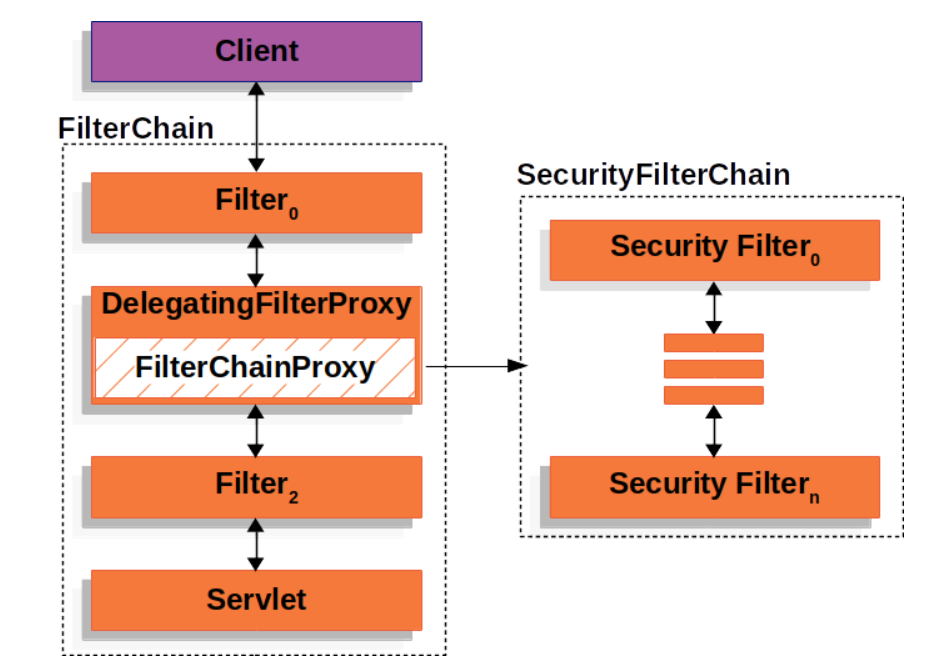

# spring security 工作流程

任何请求抵达 servlet 之前要经过三个 filter, filter 0 和 2 都可以自定义，1 是 spring security 用的。在第二个 filter 中有 spring security 写好的 SecurityFilterChain, 这个 chain 对所有请求有效，当然我也可以写自己的 filter chain,只对特定路径生效，如下图所示

只要匹配到任何一个 chain 就不会继续往下匹配了，只要这个 chain 走过了 spring security 的检测就通过了

# Security Filters

每个 SecurityFilterChain 有若干个 filters, 这些 filter 需要合理配置执行顺序，比如抵御攻击要在认证之前，认证要在授权之前

# 查看当前已加载的 SecurityFilterChain 中的 SecurityFilter 顺序

去测试程序，在 22 行加个断点就行了

# 自定义一个 Security 并且添加到特定位置
