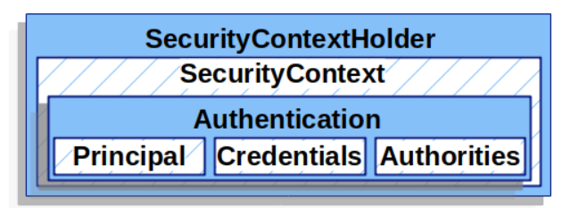
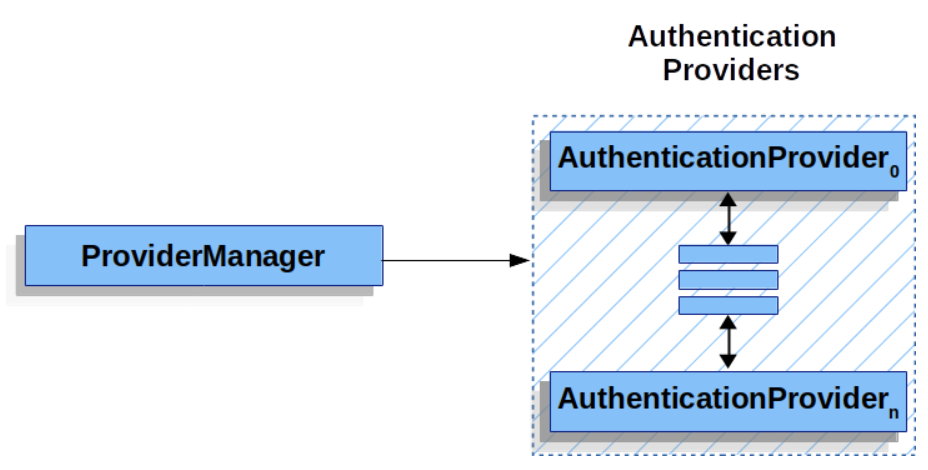
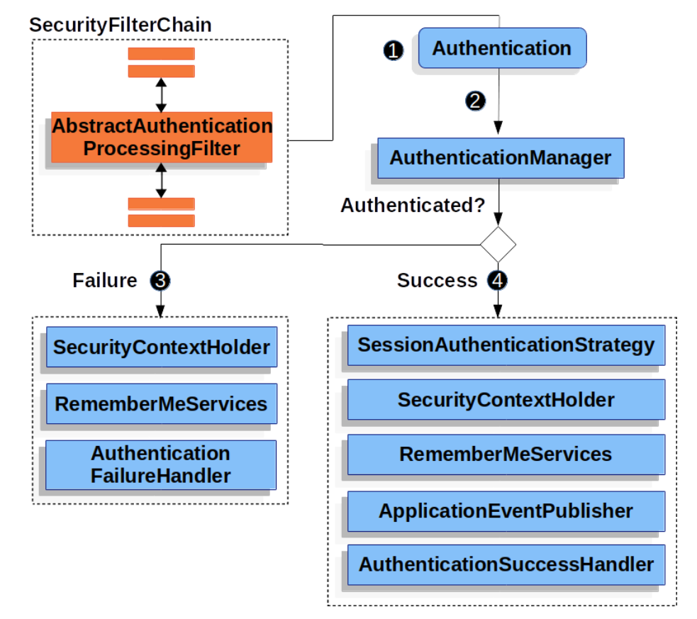

# 认证步骤涉及到的对象/概念

## SecurityContextHolder/SecurityContext/Authentication

### SecurityContextHolder

保存着已认证的所有用户的信息

### SecurityContext

从 SecurityContextHolder 获得，当前已认证用户的信息，包括一个 Authentication 对象

### Authentication

两个作用：

1. 获取用户信息，比如 Principal/Credentials/Authorities
2. 用户发送请求并附带 Credential 时，将 Credential 封装为 Authentication 对象交给 AuthenticationManager 进行验证

## GrantedAuthority

每个 GrantedAuthority 都是给 principal 的一项 authority,每个 authority 通常是一个 role

## AuthenticationManager/ProviderManager/AuthenticationProvider

### AuthenticationManager

是一个接口，定义了 Spring security 如何进行认证操作,里面有一个 authenticate 方法，接受一个只包含 credential 的简陋的 Authentication 参数，如果认证成功会返回一个包含该用户完整信息的 Authentication 对象

### ProviderManager & AuthenticationProvider

AuthenticationManager 接口的最常用实现类，它包含多个 AuthenticationProvider，每个 AuthenticationProvider 可对一种类型的 Authentication 进行认证，每个 AuthenticationProvider 都对 incoming Authentication 对象做出「认证成功」或「认证失败」或「无法对当前 Authentication」做出判断，然后把 Authentication 对象传递给下一个 AuthenticationProvider。如下图所示

每个 AuthenticationProvider 可对一种 Authentication 做出认证，比如某个 AuthenticationProvider 可对用户名密码做出认证，还有某个 AuthenticationProvider 可对 JWT 做出认证（这个得额外配置），如果所有 AuthenticationProvider 都无法对特定 Authentication 做出认证，会报错 ProviderNotFoundException

如何查看 ProviderManager 具体有哪些 AuthenticationProvider?找到这个包并且在构造函数那里打断点

## Request Credentials with AuthenticationEntryPoint

AuthenticationEntryPoint 是一个接口，里面有一个 commence 方法，当用户未认证时其某个实现类会启动一个认证方案，比如将用户重定向到登录页或者发送一个 WWW-Authenticate 响应头

## 整体流程

用户把 credential 发过来之后，首先被打包成 Authentication 对象，交给 AUthenticationManager 来认证，认证成功就返回一个所有用户信息被填充完毕的完整的 Authentication 对象，失败则另说，具体流程如下：

