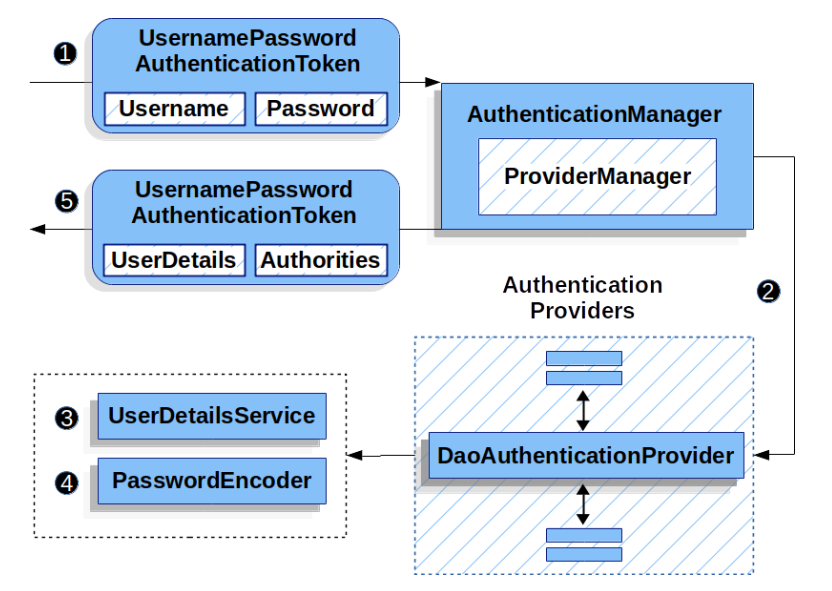

# 大体认证流程

1. 用户通过请求发送过来的用户名和密码通过 UsernamePasswordAuthenticationToken 包装为一个简单的 Authentication 对象，这个对象只包括最基础的用户名和密码
2. 这个最简单的 Authentication 对象被扔给 AuthenticationManager 的实现类 ProviderManager,这个 ProviderManager 可能包括很多 AuthenticationProvider, 其中就有 DaoAuthenticationProvider
3. DaoAuthenticationProvider 调用 UserDetailsService 中的 loadUserByUsername 方法获取数据库或其他什么地方的用户信息
4. DaoAuthenticationProvider 通过注入找到 PasswordEncoder
5. ProviderManager 将步骤 1 中的 Authentication 对象以及 UserDetails 以及 PasswordEncoder 组合起来验证一下用户密码是否匹配，成功的话返回一个新的 Authentication 对象，这个对象包括用户的各种信息
